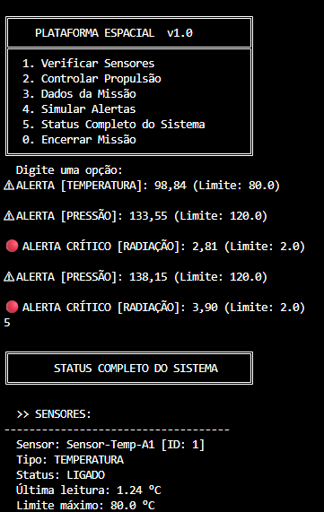
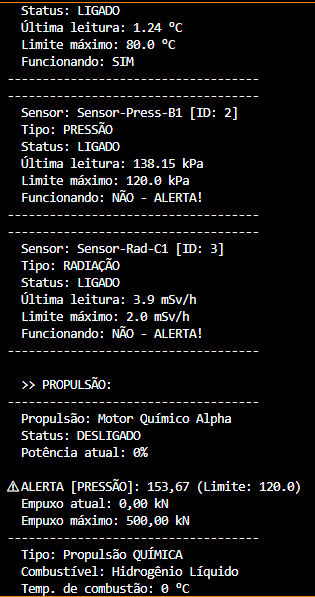
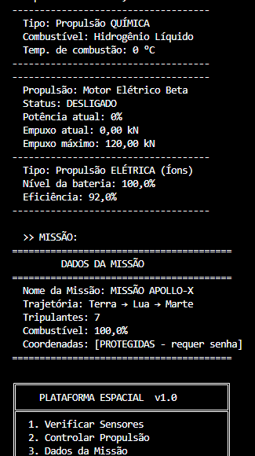
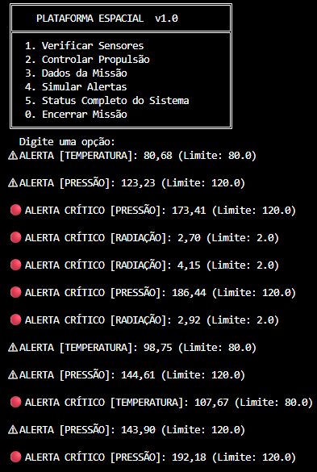

# 🚀 Plataforma de Monitoramento Espacial

Um sistema completo de monitoramento para estações espaciais desenvolvido em Java com os conceitos fundamentais de Programação Orientada a Objetos.

---

## Integrantes

| Nome | RM |
|------|----|
| *(André Ayello de Nobrega)* | *(RM561754)* |
| *(André Gouveia de Lima)* | *(RM564219)* |
| *(Mirella Mascarenhas)* | *(RM562092)* |

---

## 📋 O Que É

A ideia é simples: você está gerenciando uma estação espacial e precisa monitorar vários sistemas pra garantir que tudo funcione normalmente. Se algo sai do controle, o sistema avisa automaticamente.

Desenvolvido como projeto final de POO, demonstrando os 4 pilares da orientação a objetos: **Abstração**, **Encapsulamento**, **Herança** e **Polimorfismo**.

## 🎯 Funcionalidades Principais

### 1. **Sistema de Sensores**
- 3 tipos diferentes de sensores (Temperatura, Pressão, Radiação)
- Leitura simulada de valores em tempo real
- Verificação automática de funcionamento
- Alertas quando valores saem dos limites

### 2. **Sistema de Propulsão**
- 2 tipos de motores: Química e Elétrica
- Controle de potência de 0 a 100%
- Cálculo automático de empuxo gerado
- Comportamentos diferentes para cada tipo (queimação vs bateria)

### 3. **Dados da Missão (Protegidos)**
- Coordenadas protegidas por senha
- Nível de combustível com alerta automático
- Trajetória e informações de tripulantes
- Validação de todos os dados

### 4. **Menu Interativo**
- Verificar sensores em tempo real
- Controlar os motores
- Gerenciar dados da missão
- Ver status completo do sistema
- Simulação de alertas

### 5. **Sistema de Alertas Automáticos**
- Monitora sensores continuamente em background
- 3 níveis de alerta: ⚠️ ATENÇÃO, 🔴 ALERTA, 💀 CRÍTICO
- Funciona enquanto o programa executa

## 🏗️ Estrutura do Projeto

```
projeto-espacial/
├── ComponenteEspacial.java      # Classe abstrata base
├── Sensor.java                  # Interface dos sensores
├── SensorTemperatura.java       # Sensor de temperatura
├── SensorPressao.java           # Sensor de pressão
├── SensorRadiacao.java          # Sensor de radiação
├── DadosMissao.java             # Dados encapsulados
├── SistemaPropulsao.java        # Classe abstrata de propulsão
├── PropulsaoQuimica.java        # Motor químico
├── PropulsaoEletrica.java       # Motor elétrico
└── SistemaMonitoramento.java    # Programa principal
```

## 🚀 Como Rodar

### Compilar
```bash
cd projeto-espacial
javac *.java
```

### Executar
```bash
java SistemaMonitoramento
```

---
## Prints do Terminal

### Colocando a opção 5 do menu

|  |  |  |  |
|---|---|---|---|
---

## 📖 Como Usar

Quando você rodar o programa, aparece um menu com 5 opções:

1. **Verificar Sensores** - Lê os valores atuais dos sensores
2. **Controlar Propulsão** - Liga/desliga motores e acelera
3. **Dados da Missão** - Gerencia coordenadas, combustível, etc
4. **Simular Alertas** - Faz 5 leituras de cada sensor pra ver alertas
5. **Status Completo** - Mostra tudo junto

### Exemplo de Uso:
```
Digite uma opção: 1
1. Ler Sensor de Temperatura
2. Ler Sensor de Pressão
3. Ler Sensor de Radiação
4. Ler Todos os Sensores
0. Voltar

Opção: 1
```

## 🔐 Proteção de Dados

As coordenadas da missão precisam de senha para visualizar ou alterar. A senha padrão é `FIAP2026`.

```java
// Só consegue ver se colocar a senha certa
String coords = missao.getCoordenadas("FIAP2026"); // ✓ Funciona
String coords = missao.getCoordenadas("123456");   // ✗ Acesso negado
```

## 🛠️ Conceitos de POO Implementados

| Conceito | Onde | Como |
|----------|------|------|
| **Abstração** | ComponenteEspacial | Classe abstrata com método exibirStatus() |
| **Encapsulamento** | DadosMissao | Atributos privados + getters/setters validados |
| **Herança** | SistemaPropulsao | Propulsão Química e Elétrica herdam |
| **Polimorfismo** | Sensor | 3 sensores implementam a interface |
| **Interfaces** | Sensor | Garante que todos os sensores têm os mesmos métodos |

## 📊 Diagrama Simplificado

```
ComponenteEspacial (abstrata)
    ↑
    ├── SensorTemperatura
    ├── SensorPressao
    └── SensorRadiacao

SistemaPropulsao (abstrata)
    ↑
    ├── PropulsaoQuimica
    └── PropulsaoEletrica

DadosMissao
    └── Protegida por senha

SistemaMonitoramento (main)
    └── Integra tudo + Menu
```

## ⚠️ Alertas

O sistema monitora automaticamente:

- **Temperatura**: Limite 80°C
- **Pressão**: Limite 120 kPa
- **Radiação**: Limite 2.0 mSv/h
- **Combustível**: Alerta abaixo de 20%

Os alertas são emitidos em 3 níveis:
- Verde/Normal: < 80% do limite
- Amarelo/Atenção: 80-100% do limite
- Vermelho/Crítico: > 100% do limite

## 💡 Curiosidades Técnicas

- Os valores dos sensores são simulados com `Math.random()`
- A bateria do motor elétrico drena com a aceleração
- Temperatura de combustão do motor químico varia com a potência
- Tudo é validado (combustível 0-100%, potência 0-100%, etc)
- O monitor de alertas roda em uma thread separada

## 📝 Requisitos Atendidos

- ✓ 4 conceitos de POO (Abstração, Encapsulamento, Herança, Polimorfismo)
- ✓ 1 classe abstrata com método abstrato
- ✓ 1 interface implementada em 3 classes
- ✓ Encapsulamento com validação
- ✓ Herança com sobrescrita de métodos
- ✓ 10 arquivos .java
- ✓ Menu interativo
- ✓ Sistema de alertas automáticos
- ✓ Sem dependências externas (só Java puro)

---
